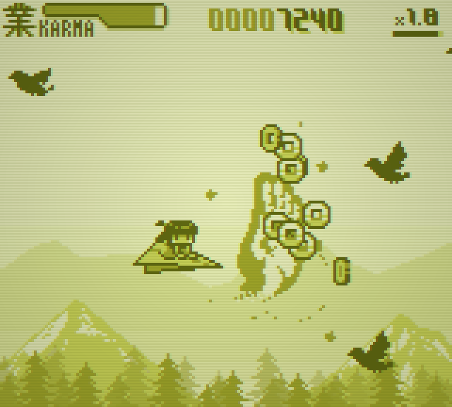

# The HAND of Salvation - 救いの手

https://github.com/voidproc/hand

「私を救ってくれるあなたは、誰？」 
少女がひとり空をゆく。謎の「手」に護られながら、行き着く先は……？

低解像度でレトロチックな 2D 横スクロールシューティングゲームです。

このゲームは [バンダイナムコスタジオ杯 Siv3D ゲームジャム](https://bandainamcostudios.connpass.com/event/295239/) 参加作品です。

## ダウンロード
- [v1.0.1（Windows 版）](https://github.com/voidproc/hand/releases/download/v1.0.1/hand.zip)
- [v1.0.0（Windows 版）](https://github.com/voidproc/hand/releases/download/v1.0.0/hand.zip)

## 操作方法
キーボードまたは XInput 対応のゲームパッド等で操作することができます。
- 移動 : 方向キー（上下左右）、WASD キー
- アクション : Space キー／長押しでチャージ
- ポーズ : Enter キー

## ルール
- 「手」を駆使して敵を倒しながら先へ進みましょう。
- 敵に当たったり、「手」を使ったりすると KARMA（カルマ、左上のゲージ）が減っていきます。KARMA がなくなるとゲームオーバーです。
- 敵を連続で倒したり、「手」を呼び出したままにすると「スコアレート（倍率）」が上昇します。倍率をどんどん稼いで、高得点を狙ってみましょう！

## 使用しているフォント
次のフォントを使用しています。
- 美咲フォント : Little Limit 様 (https://littlelimit.net/)
- JFドットM+H10、JFドット東雲明朝12 : 自家製フォント工房 様 (http://jikasei.me/)

## 使用している BGM
次のサイトで公開されている BGM を使用しています。
- seadenden 8bit freeBGM 様 (https://seadenden-8bit.com)

## 開発環境
- Windows 11
- Visual Studio 2022
- OpenSiv3D v0.6.12

## ソースコードのライセンス
[LICENSE](./LICENSE)

## スクリーンショット

## 更新履歴
- v1.0.1
  - ゲームオーバー時などに BGM が流れ続けてしまう不具合を修正
  - メモリ使用量を改善（オーディオ関連）
