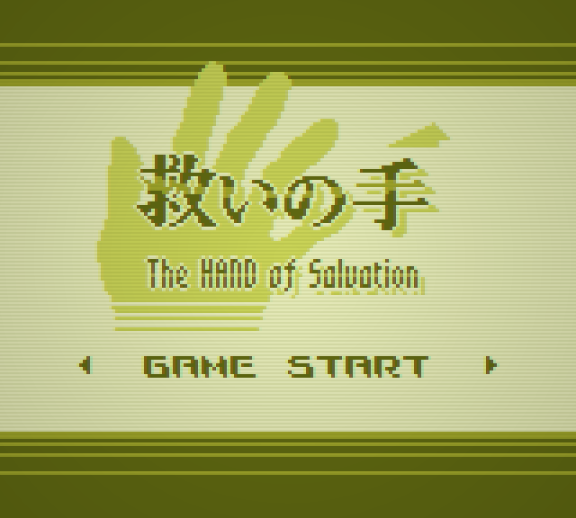

# The HAND of Salvation - 救いの手

https://github.com/voidproc/hand

「私を救ってくれるあなたは、誰？」 
2D 横スクロールシューティングゲーム。
謎の「手」に護られる少女が行き着く先は……？

このゲームは [バンダイナムコスタジオ杯 Siv3D ゲームジャム](https://bandainamcostudios.connpass.com/event/295239/) 参加作品です。

## 操作方法
- 移動 : 方向キー（上下左右）、WASD キー
- アクション : Space キー／長押しでチャージ
- ポーズ : Enter キー

## ルール
- 「手」を駆使して敵を倒しながら先へ進みましょう。
- 敵に当たったり、「手」を使ったりするとカルマが減っていきます。カルマが無くなるとゲームオーバーです。
- 敵を連続で倒したり、「手」を呼び出したままにすると「スコアレート（倍率）」が上昇します。

## BGM
「seadenden 8bit freeBGM」様が公開されている BGM を使用しています。

https://seadenden-8bit.com

## 開発環境
- Windows 11
- Visual Studio 2022
- OpenSiv3D v0.6.12

## ソースコードのライセンス
[LICENSE](./LICENSE)

## スクリーンショット

